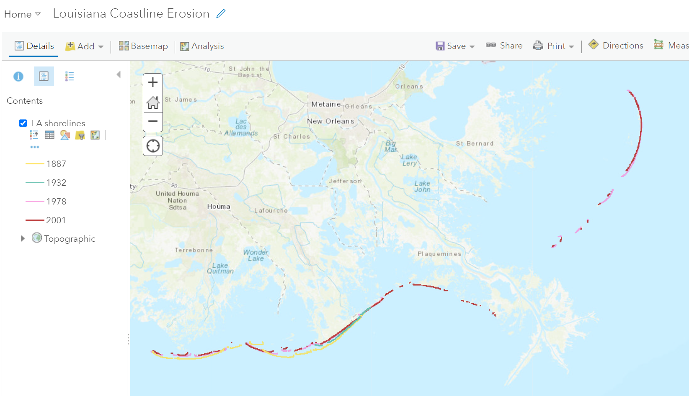

## Portfolio

---

### Spatial Analysis 

[Hot Spot Analysis](/pdf/SGrego_GIS5253_Final_Memorandum.pdf)

---

### Online Mapping

---

### Data Management

[Geotagging](/pdf/Final_Project_Report_GIS_5970.pdf)

---

### Remote Sensing

[SWIR](https://sarahgrego.users.earthengine.app/view/split-panel-burned-area----ca-fire-2019)

---

Page template forked from <a href="https://github.com/evanca/quick-portfolio">evanca</a>

<!-- Remove above link if you don't want to attibute -->
